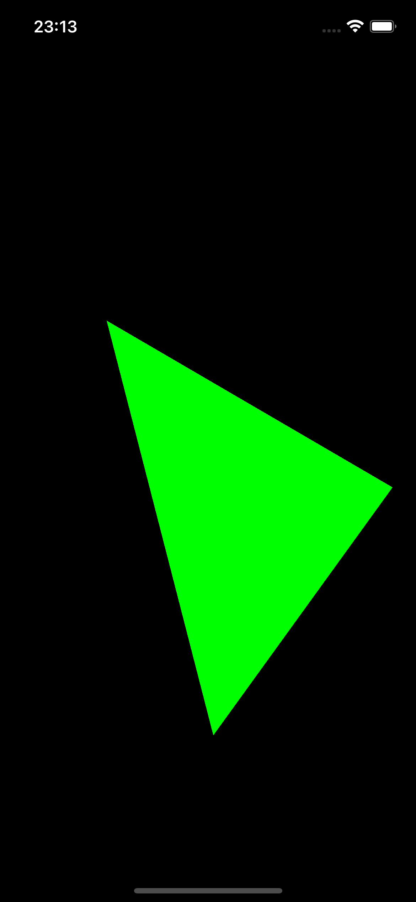

# TriangleDemo

Demo ứng dụng render một tam giác - đơn bị hình học cơ bản của GPU sử dụng Metal từ dữ liệu tọa độ kiểu UIKit.

## Mục tiêu project

- Dựng pipeline render Metal đầy đủ nhưng dễ hiểu.
- Tách rõ phần dữ liệu hình học, phần chuyển đổi tọa độ và phần submit lệnh GPU.
- Dùng tọa độ thân thiện với iOS dev (UIKit: gốc trái-trên) rồi chuyển sang toạ độ thiết bị - Normalized Device Coordinates(NDC) để vẽ.

## Render Pipeline

Pipeline hiện tại đi theo luồng sau:

1. **Input tọa độ hình học (UIKit space)**  
   Tam giác được định nghĩa trong `Renderer.swift` bằng các điểm kiểu 2D như với dạng `SIMD2(200, 100)`.

2. **Chuẩn hóa tọa độ sang Metal NDC**  
   `Model.swift` thực hiện phép đổi:
   - `x_ndc = (x / width) * 2 - 1`
   - `y_ndc = 1 - (y / height) * 2`

## Tư duy tiếp cận vấn đề

Project tiếp cận với tư duy đơn giản:

- **Chọn một hệ tọa độ logic duy nhất cho app**: UIKit points để dev dễ nhập/chỉnh.
- **Giữ data layout nhất quán CPU/GPU**: Swift ghi kiểu gì, shader đọc đúng kiểu đó.

## Chạy project

- Mở `TriangleDemo.xcodeproj` bằng Xcode.
- Chọn simulator hoặc thiết bị iOS(iPhone, iPad).
- Build & Run để thấy tam giác được render bằng Metal.
